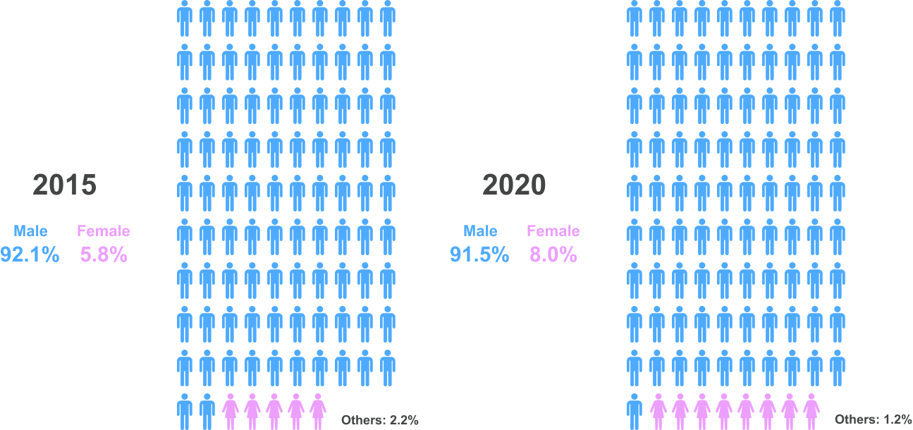
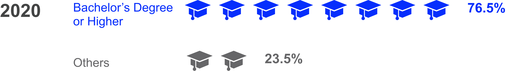

<html>
<h1> Trends Discovered From Stack Overflow </h1>

<h2> Introduction </h2>

Stack Overflow is the largest online community for developers to share their knowledge and learn. Programmers can ask questions freely, and the community members can answer them if they can help. As Stack Overflow is a place where many developers have been actively communicating for the previous years, we were confident that we could gain some insights from the data available from Stack Overflow.
We wanted to visualize and inform professional developers and people who are interested to start learning programming languages with our work by keeping them updated with some latest trends that can be observed from Stack Overflow.

<h2> Demographic Trend </h2>

Based on a worldwide survey done by developers who use Stack Overflow over the years, more men are working in software development than women. Although there are still more work to be done to reach appropriate gender representation in the field, women developers have increased if we compare the two years as below.

 
 
 

From the survey, developers who completed at least the equivalent of a bachelor’s degree or higher were approximately 76% of respondents in 2020, which has been consistent from previous years.

 
 
 

<h2> Programming Trend </h2>

Programming is gaining more momentum and we all are excited to know what awaits the tech industry in the nearest future. We have discovered some decline of good old programming languages and some emerging ones that can help developers stay updated with all the latest trends. 

 
 
 

<noscript></noscript><object class='tableauViz'  style='display:none;'><param name='host_url' value='https%3A%2F%2Fpublic.tableau.com%2F' /> <param name='embed_code_version' value='3' /> <param name='path' value='shared&#47;33NDFTS4M' /> <param name='toolbar' value='yes' /><param name='static_image' value='https:&#47;&#47;public.tableau.com&#47;static&#47;images&#47;33&#47;33NDFTS4M&#47;1.png' /> <param name='animate_transition' value='yes' /><param name='display_static_image' value='yes' /><param name='display_spinner' value='yes' /><param name='display_overlay' value='yes' /><param name='display_count' value='yes' /><param name='language' value='en' /><param name='filter' value='publish=yes' /></object>
                

 
 
 

Besides popularity, the connections between programming languages are also changing over years. Some languages are gradually coming to the center of the network, yet others are slowly being marginalized.

 
 
 

<iframe width="100%" height="390" frameborder="0"
  src="https://observablehq.com/embed/@info247-spring21/2014-connections-between-tags?cells=chart"></iframe>
  
<iframe width="100%" height="390" frameborder="0"
  src="https://observablehq.com/embed/@info247-spring21/2019-connections-between-tags?cells=chart"></iframe>

<h2> Community Culture Trend </h2>

Many developers find Stack Overflow to be a valuable resource to ask and answer questions related to programming. Users can be both askers and answerers and Stack Overflow works well as the community members are working together towards a common goal: Help improve the skill of software developers so they can solve their problems.

 
 
 

<noscript></noscript><object class='tableauViz'  style='display:none;'><param name='host_url' value='https%3A%2F%2Fpublic.tableau.com%2F' /> <param name='embed_code_version' value='3' /> <param name='site_root' value='' /><param name='name' value='community_culture&#47;CommunityCultureTrend' /><param name='tabs' value='no' /><param name='toolbar' value='yes' /><param name='static_image' value='https:&#47;&#47;public.tableau.com&#47;static&#47;images&#47;co&#47;community_culture&#47;CommunityCultureTrend&#47;1.png' /> <param name='animate_transition' value='yes' /><param name='display_static_image' value='yes' /><param name='display_spinner' value='yes' /><param name='display_overlay' value='yes' /><param name='display_count' value='yes' /><param name='language' value='en' /></object>
                

</html>
